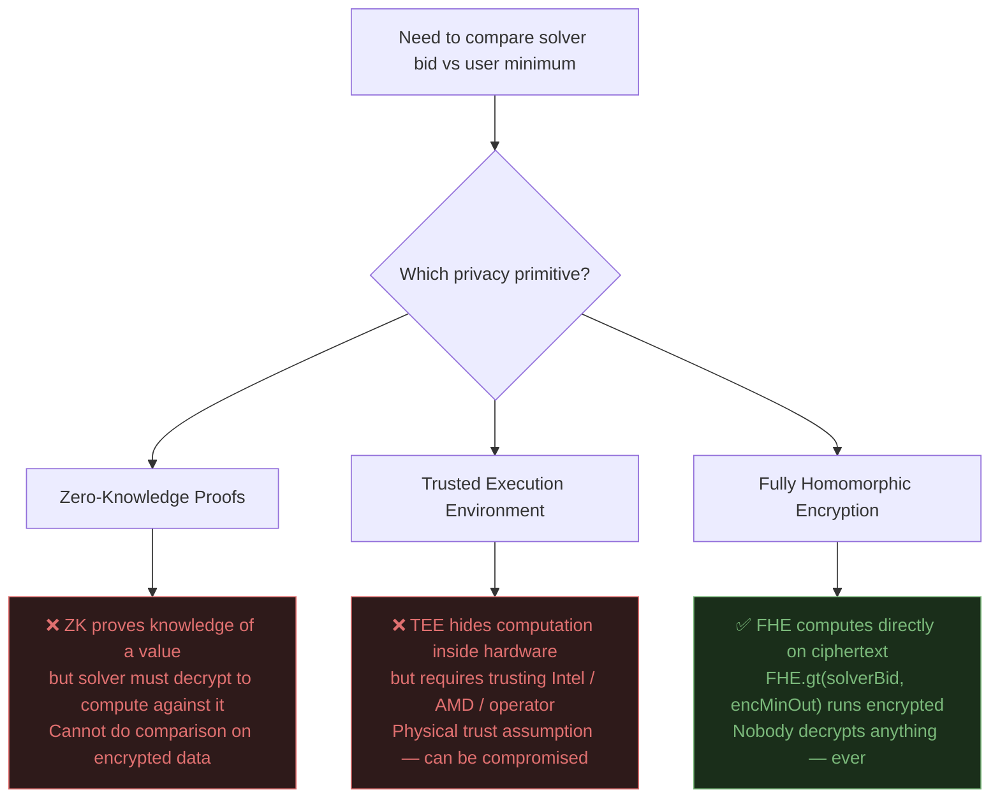
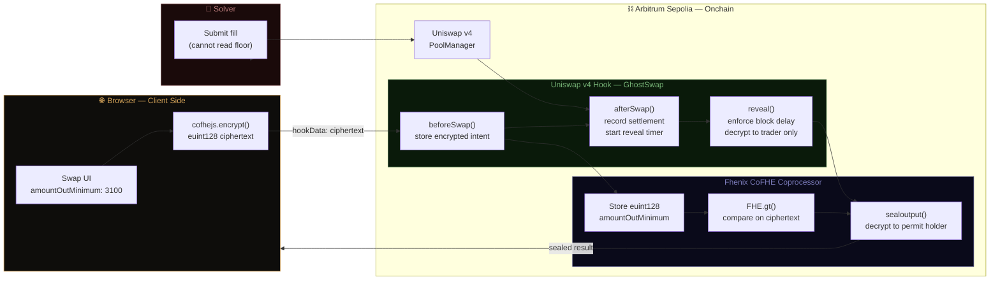
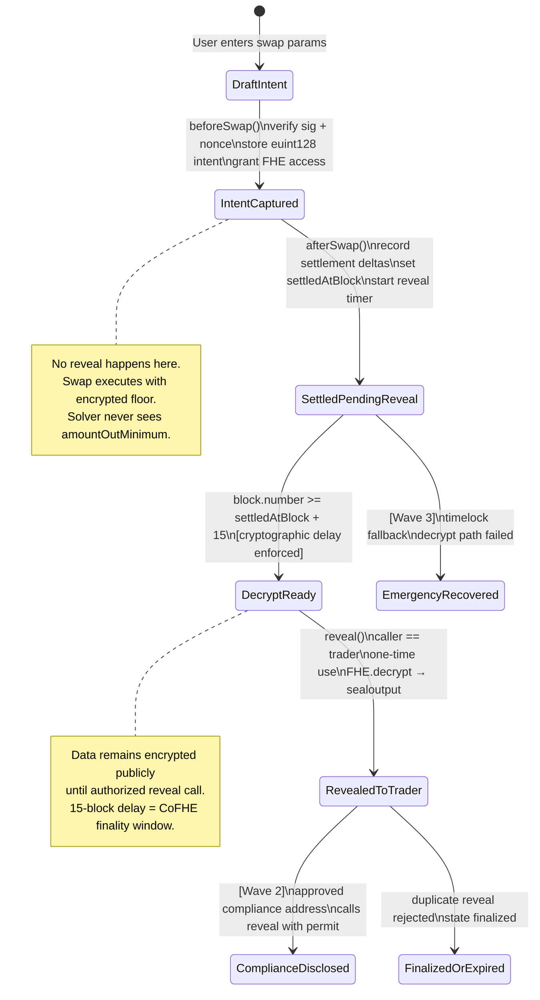
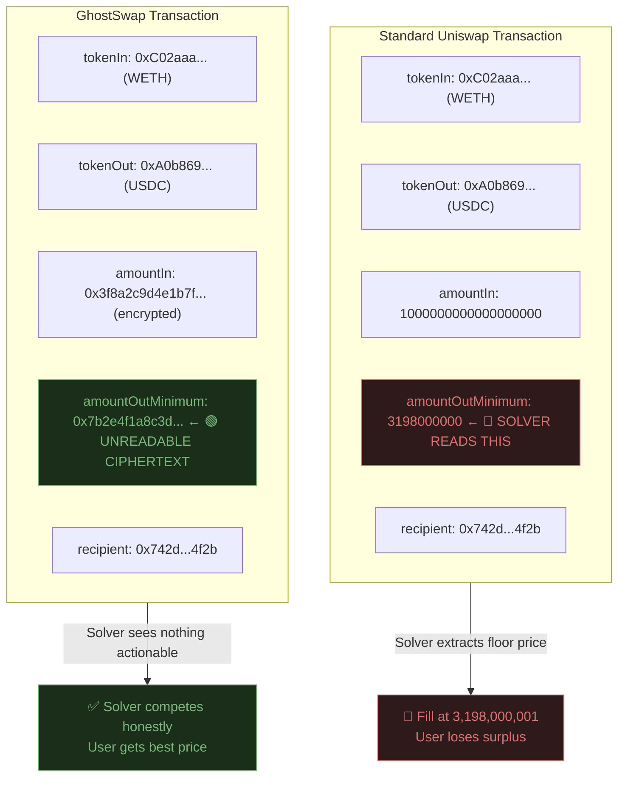
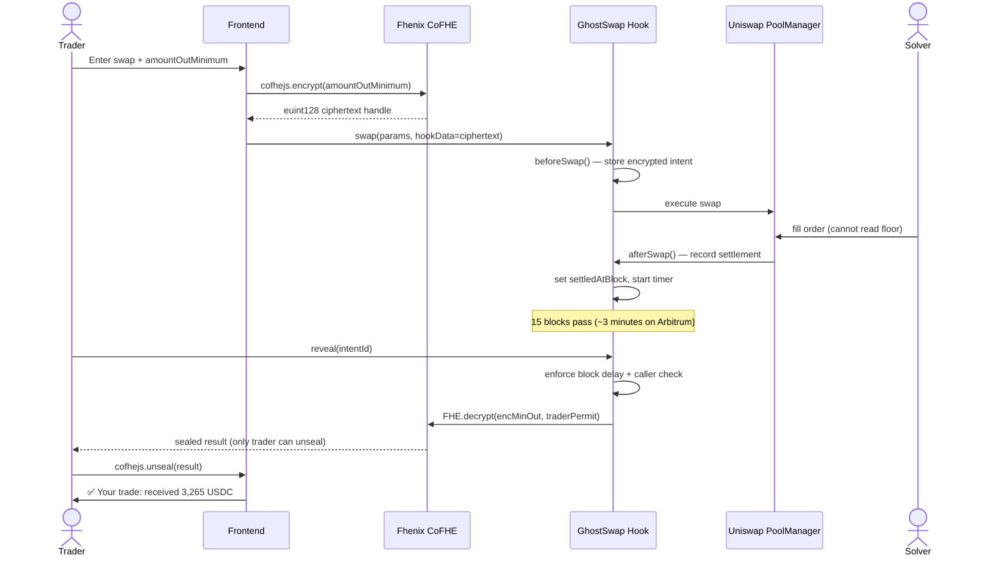
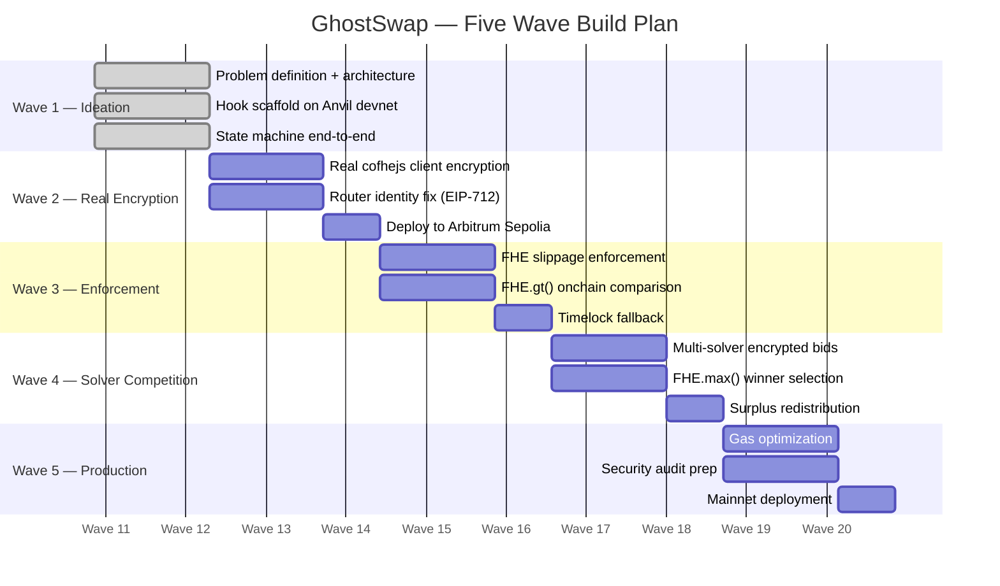
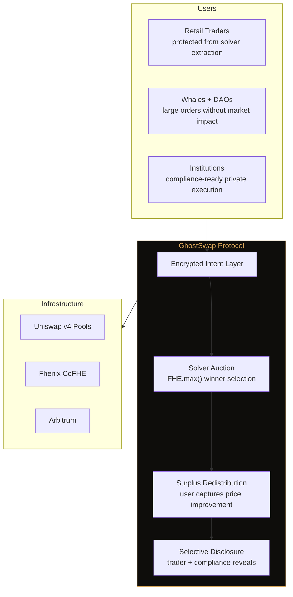

# 👻 GhostSwap

> **Private swap execution on Uniswap v4. Your reservation price — encrypted, always.**

Built on **Fhenix CoFHE** · **Uniswap v4 Hooks** · **Arbitrum Sepolia**

---

## The Problem Nobody Talks About

Web3 is supposed to be trustless. That's the founding promise.

But right now, every swap you make on every DEX requires you to trust that the solver filling your order won't exploit your visible reservation price. When you submit a swap, your `amountOutMinimum` — the worst price you'll accept — is broadcast in plaintext to every solver, validator, and market maker on the network **before your trade executes.**

The solver doesn't need to give you a good price. They just need to beat your floor by 1 wei.

### A Concrete Example

```
You want:   22 ETH → DAI
Best price: 3,300 DAI/ETH  (available in the market)
Your floor: 3,100 DAI/ETH  (your amountOutMinimum — visible to everyone)

What happens:
  Solver reads your floor → fills you at 3,102 DAI/ETH
  You receive: 68,244 DAI
  Solver keeps: ~4,356 DAI  ← extracted from you, legally, invisibly

What should happen:
  Solver cannot read your floor → must compete on honest best price
  You receive: 72,600 DAI
  Solver keeps: fair margin only
```

This happens on every transparent DEX. On every trade. To every user. An estimated **$500M+ is extracted from DeFi users annually** through this mechanism alone.

---

## Why Existing Solutions Don't Fix This

| Solution | What It Solves | What It Doesn't Solve |
|---|---|---|
| Flashbots Protect | Hides order from public mempool bots | Solver still sees `amountOutMinimum` in plaintext |
| MEV Blocker | Reduces sandwich attacks | Solver-side price extraction unchanged |
| CoW Protocol | Batch settlement, some MEV protection | Solver committee sees order parameters |
| Private RPC | Public front-running | Not solver-side extraction |
| **GhostSwap** | **Solver never reads your floor — mathematically** | — |

Flashbots and private mempools solve **public front-running.**

They do not solve **solver-side reservation price extraction.**

These are two different problems. Only one of them was solved. Until now.

---

## The Solution — Encrypted Intent

GhostSwap encrypts `amountOutMinimum` before it leaves your browser using **Fhenix CoFHE**. The solver receives a ciphertext. They compute against it without ever decrypting it. They are forced to fill at their honest best price.

```
Standard Uniswap:   uint256 amountOutMinimum = 3100000000;  ← readable by everyone
GhostSwap:          euint128 amountOutMinimum = 0x3f8a2c…;  ← unreadable ciphertext
```

After settlement, after a cryptographically enforced block delay, **only you** can decrypt and see your trade result. Nobody else. Not the solver. Not the validator. Not the protocol operator.

This is not a policy guarantee. It is a mathematical one.

---

## Why FHE — Not ZK, Not TEE

This is the most important architectural decision in GhostSwap. FHE is not used because it's novel — it's used because it's the **only primitive that actually solves the problem.**



Remove FHE and the privacy guarantee collapses. There is no substitute.

---

## Architecture

### System Overview



---

### Hook Lifecycle — State Machine



---

### Mempool Comparison — What Solvers See



---

### Callback Mapping



---

## Contract Structure

```
src/
├── PostSettleRevealHook.sol       ← Core hook contract
│   ├── beforeSwap()               ← Capture + store encrypted intent
│   ├── afterSwap()                ← Record settlement, start timer
│   ├── reveal()                   ← Enforce delay, decrypt to trader
│   └── getHookPermissions()       ← Register beforeSwap + afterSwap
│
├── interfaces/
│   └── IGhostSwap.sol             ← External interface
│
└── libraries/
    └── IntentLib.sol              ← Intent struct + encoding helpers
```

### Core Data Structures

```solidity
// The encrypted intent — stored onchain after beforeSwap
struct SwapIntent {
    euint128 amountOutMinimum;  // 🔒 encrypted — never readable in plaintext
    address trader;              // intent owner (Wave 2: from EIP-712 sig)
    uint256 settledAtBlock;      // set by afterSwap
    uint256 decryptReadyBlock;   // settledAtBlock + REVEAL_DELAY
    SwapState state;             // lifecycle state
    int128 actualAmountOut;      // recorded at settlement
}

// Five lifecycle states
enum SwapState {
    Empty,
    IntentCaptured,
    SettledPendingReveal,
    DecryptReady,
    Revealed
}
```

### FHE Operations Used

| Operation | Where | Purpose |
|---|---|---|
| `FHE.asEuint128(InEuint128)` | `beforeSwap` | Convert client ciphertext to onchain encrypted type |
| `FHE.allowTransient(euint128, address)` | `beforeSwap` | Grant CoFHE access to hook |
| `FHE.decrypt(euint128)` | `reveal` | Async decrypt request to CoFHE coprocessor |
| `FHE.sealoutput(euint128, bytes)` | `reveal` | Seal result to trader's public key only |

---

## Wave Roadmap



### Wave-by-Wave Deliverables

**Wave 1 — Foundation** *(current)*
- Problem definition and architecture specification
- Hook lifecycle implementation on local Anvil devnet
- State machine: `DraftIntent → IntentCaptured → SettledPendingReveal → DecryptReady → Revealed`
- Frontend connected to real contracts (mock FHE encryption)
- Full codebase audit completed — gaps documented honestly

**Wave 2 — Real Cryptography**
- Replace mock signing with real `cofhejs` browser-side encryption
- Fix router identity: EIP-712 signed intents with explicit trader address in `hookData`
- Deploy to Arbitrum Sepolia against real CoFHE coprocessor
- Real ciphertext visible in mempool — demo-able contrast with standard Uniswap

**Wave 3 — Slippage Enforcement**
- Implement `FHE.gt(actualOutput, encryptedMinOut)` in `afterSwap`
- Hook rejects fills below encrypted minimum — **the privacy claim becomes a security guarantee**
- Emergency timelock fallback for failed decrypt paths
- Compliance address reveal via permit system

**Wave 4 — Solver Competition**
- Multiple solvers submit encrypted bids per intent
- `FHE.max()` selects winner onchain without revealing losing bids
- Surplus redistribution: user captures share of price improvement
- This transforms GhostSwap from privacy tool to honest price discovery engine

**Wave 5 — Production Readiness**
- Gas benchmarks vs standard Uniswap v4
- Security assumptions documented
- Mainnet deployment plan
- Fhenix Incubator application
- Uniswap Hook Design Lab grant application

---

## Long-Term Vision

GhostSwap is not a hackathon project. It is **the missing plumbing.**

### The Market

Every DEX built on transparent rails has this problem. Every user on every swap is exposed to solver-side price extraction. The market has accepted it as background noise — an invisible tax that users absorb without understanding.

The addressable market is every DeFi swap. Uniswap alone processes $1-3B daily volume. At conservative 0.1% solver-side extraction, that's $1-3M extracted daily from users who have no idea it's happening.

### The Protocol

At maturity, GhostSwap becomes a **universal encrypted intent layer** for Uniswap v4:



### The Business Model

- **Protocol fee:** Small percentage of surplus captured for users vs baseline AMM execution
- **Compliance API:** Institutions pay for programmable selective disclosure — prove trades to auditors without broadcasting to market
- **Solver registration:** Solvers stake to participate in encrypted auctions — stake slashed for fills below encrypted minimum

### Why Now

Fhenix CoFHE making FHE computation practical on EVM is the enabling event. The cryptographic readiness wasn't there before 2025. The problem has existed since Uniswap v1. The solution is now buildable. First-mover advantage in encrypted swap execution is measured in months, not years.

---

## Technical Stack

| Layer | Technology | Purpose |
|---|---|---|
| Smart Contracts | Solidity 0.8.24 + Foundry | Hook logic, state machine |
| FHE Library | Fhenix `FHE.sol` | Encrypted types + operations |
| Hook Framework | Uniswap v4 `BaseHook` | `beforeSwap` + `afterSwap` callbacks |
| Client Encryption | `cofhejs` | Browser-side FHE encryption |
| Frontend | React + Vite + Tailwind | Swap UI + reveal interface |
| Testnet | Arbitrum Sepolia | CoFHE coprocessor deployment |
| Local Dev | Anvil + `cofhe-mock-contracts` | Development + testing |

---

## Current Status

### What Works (Wave 1)

| Component | Status | Notes |
|---|---|---|
| Hook state machine | ✅ Working | All 5 states transition correctly |
| Block-based reveal delay | ✅ Working | 15-block enforcement onchain |
| Trader-only reveal auth | ✅ Working | Caller verification in `reveal()` |
| Local devnet end-to-end | ✅ Working | Anvil + mock CoFHE |
| Frontend → contract | ✅ Connected | Real contract calls, not simulated |
| Forge test suite | ✅ Passing | Happy path + guard rails |

### Known Gaps (Wave 2 Targets)

| Gap | Impact | Wave 2 Fix |
|---|---|---|
| Router identity | Intent ownership attributed to router not user | EIP-712 signed intents |
| Mock client encryption | Plaintext sent to mock verifier | Real `cofhejs` encryption |
| No slippage enforcement | `encMinOut` stored but not compared | `FHE.gt()` in `afterSwap` |
| No async decrypt callback | Reveal emits stored data not FHE result | Real CoFHE decrypt flow |

These gaps are documented honestly. Wave 1 proves the scaffold and lifecycle. Wave 2 makes the cryptography real.

---

## Setup & Development

### Prerequisites

```bash
# Foundry
curl -L https://foundry.paradigm.xyz | bash
foundryup

# Node 18+
node --version  # must be >= 18
```

### Local Development

```bash
# Clone
git clone https://github.com/anxbt/fhe-hook-template
cd fhe-hook-template

# Install dependencies
forge install

# Run tests
forge test -vv

# Start local devnet
anvil --block-time 2

# Deploy locally
forge script script/99_LocalSetup.s.sol --rpc-url localhost --broadcast
```

### Frontend

```bash
cd frontend
npm install
npm run dev
# → http://localhost:5173
```

### Environment Variables

```bash
# .env
PRIVATE_KEY=           # deployer key
ARBITRUM_SEPOLIA_RPC=  # for testnet deployment
ETHERSCAN_API_KEY=     # for contract verification
```

---

## Resources

| Resource | Link |
|---|---|
| Fhenix CoFHE Docs | [cofhe-docs.fhenix.zone](https://cofhe-docs.fhenix.zone) |
| Fhenix Quick Start | [cofhe-docs.fhenix.zone/fhe-library/introduction/quick-start](https://cofhe-docs.fhenix.zone/fhe-library/introduction/quick-start) |
| Uniswap v4 Docs | [docs.uniswap.org/contracts/v4](https://docs.uniswap.org/contracts/v4) |
| Awesome Fhenix | [github.com/FhenixProtocol/awesome-fhenix](https://github.com/FhenixProtocol/awesome-fhenix) |
| Hook Template | [github.com/marronjo/fhe-hook-template](https://github.com/marronjo/fhe-hook-template) |
| Fhenix Buildathon | [app.akindo.io/wave-hacks/Nm2qjzEBgCqJD90W](https://app.akindo.io/wave-hacks/Nm2qjzEBgCqJD90W) |

---

## Why This Wins

Web3 promised trustless systems. Every swap made since Uniswap v1 has required trusting that the solver filling your order won't exploit your visible reservation price.

That's not trustless. That's trust with extra steps.

GhostSwap removes that trust requirement. Not by policy. Not by reputation. By math.

The `amountOutMinimum` that has been sitting in plaintext on every DEX transaction for seven years — encrypted, finally, at the source.

---

*Built for the Fhenix × AKINDO Private By Design dApp Buildathon · Wave 1 · March 2026*

*Fhenix CoFHE + Uniswap v4 + Arbitrum Sepolia*