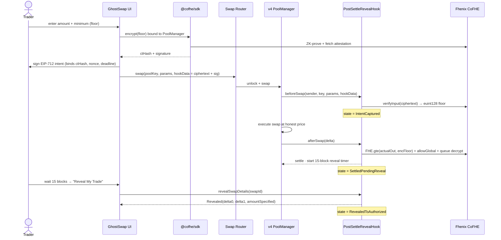
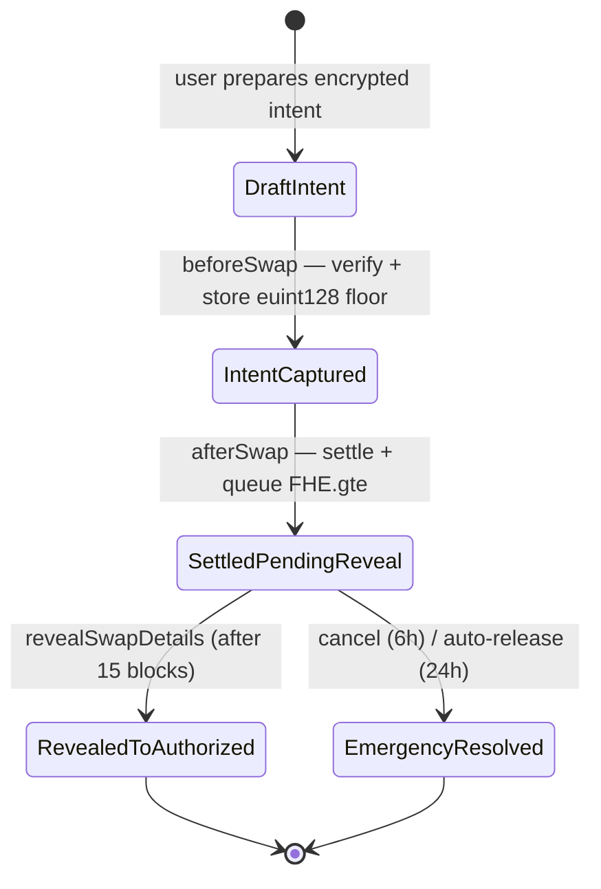
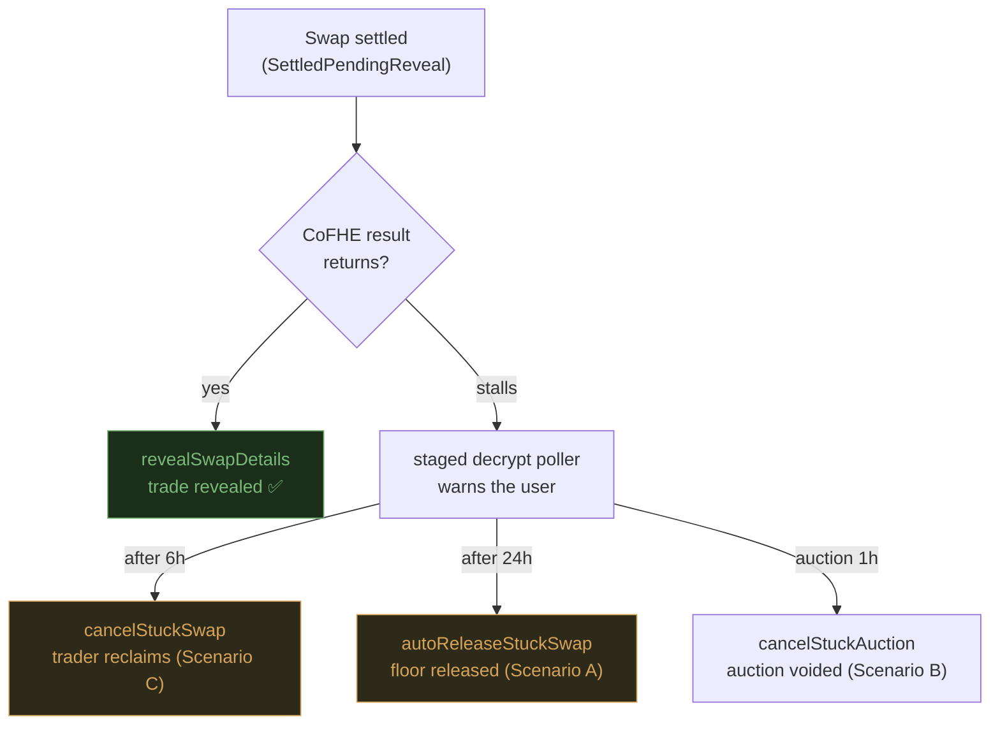
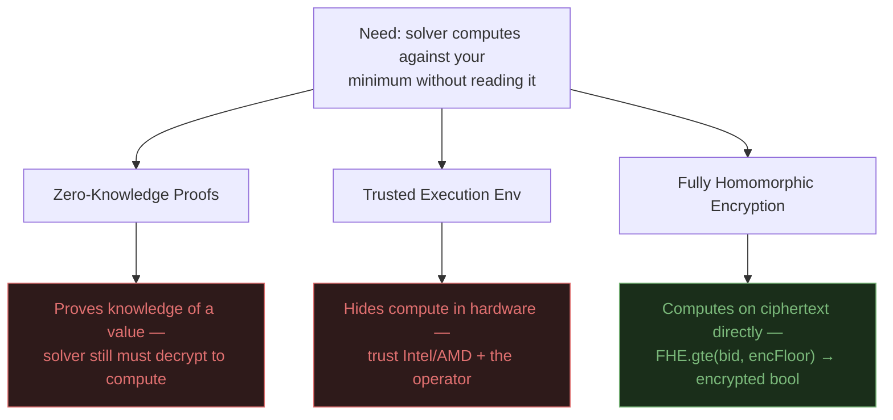
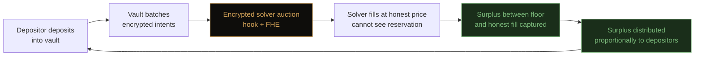

# 👻 GhostSwap

> **Private swap execution on Uniswap v4. Your reservation price is encrypted before it leaves your browser — solvers compete on a floor they mathematically cannot read, and recaptured surplus becomes yield for vault depositors.**

Built on **Fhenix CoFHE** · **Uniswap v4 Hooks** · **Arbitrum**

---

## 🟢 Live on Arbitrum Sepolia

The full encrypted lifecycle — **encrypt → swap → reveal** — runs end-to-end on the **live Fhenix CoFHE coprocessor** (not mocks).

| Contract | Address | Explorer |
|---|---|---|
| **PostSettleRevealHook** (the v4 hook) | `0x8924a551733B93D5F486922cf76C7A8F8C81C0C0` | [Arbiscan ↗](https://sepolia.arbiscan.io/address/0x8924a551733B93D5F486922cf76C7A8F8C81C0C0) |
| **GhostVault** | `0xc37Ca537735e1DB1CEde55bbA53De087fd4321e6` | [Arbiscan ↗](https://sepolia.arbiscan.io/address/0xc37Ca537735e1DB1CEde55bbA53De087fd4321e6) |
| **GhostVaultPeriphery** | `0x14F8485da345d5430A2Ec25F24F80e1FFa99A45E` | [Arbiscan ↗](https://sepolia.arbiscan.io/address/0x14F8485da345d5430A2Ec25F24F80e1FFa99A45E) |
| **SwapRouter** (PoolSwapTest) | `0x30319f077cd66c0189cfFc065547Ad607622FE14` | [Arbiscan ↗](https://sepolia.arbiscan.io/address/0x30319f077cd66c0189cfFc065547Ad607622FE14) |
| **PoolManager** (canonical Uniswap v4) | `0xFB3e0C6F74eB1a21CC1Da29aeC80D2Dfe6C9a317` | [Arbiscan ↗](https://sepolia.arbiscan.io/address/0xFB3e0C6F74eB1a21CC1Da29aeC80D2Dfe6C9a317) |
| **gETH** (test token0) | `0x905EBaEBED3aa0b9b957081cC48D71f400f7fC25` | [Arbiscan ↗](https://sepolia.arbiscan.io/address/0x905EBaEBED3aa0b9b957081cC48D71f400f7fC25) |
| **gUSDC** (test token1) | `0xACbA3E1c01727DfE0f0D9b0F3172F2BE205B4f9f` | [Arbiscan ↗](https://sepolia.arbiscan.io/address/0xACbA3E1c01727DfE0f0D9b0F3172F2BE205B4f9f) |

**On-chain proof — full lifecycle:**

| Step | Tx | Explorer |
|---|---|---|
| 🔐 Encrypted swap (ciphertext in calldata) | `0xe87ab2a3…584dd3` | [View tx ↗](https://sepolia.arbiscan.io/tx/0xe87ab2a3d8d23ce4a00b306a417b3e52066d9ea34e866594179de34c8c584dd3) |
| 👁️ Reveal trade details (after delay) | `0x89bc1650…1c9b12` | [View tx ↗](https://sepolia.arbiscan.io/tx/0x89bc1650eecebf1f01b61da809ca450cdd1e29eb7220a0b736ce0f47c61c9b12) |

> Open the swap tx → **Input Data** on Arbiscan: the `amountOutMinimum` appears as **ciphertext, not a plaintext number**. That's the whole product.

**Network:** Arbitrum Sepolia (chainId `421614`) · **Reveal delay:** 15 blocks · **Tests:** 83 passing (Foundry)

---

## What GhostSwap Is

Every swap on every transparent DEX broadcasts your `amountOutMinimum` — the worst price you'll accept — in plaintext before settlement. Solvers read the floor and fill at it, keeping the surplus. This is solver-side price extraction: legal, invisible, systematic.

GhostSwap encrypts that floor **client-side with Fhenix CoFHE** and encodes it into the swap's `hookData`. The Uniswap v4 hook verifies the encrypted input on-chain, runs the slippage comparison **directly on ciphertext** (`FHE.gte`), and never decrypts your minimum. Recaptured surplus is routed to `GhostVault` depositors as yield.

```
Standard Uniswap                         GhostSwap
─────────────────                        ─────────
Market price : 3,300 USDC/ETH            Market price : 3,300 USDC/ETH
Your floor   : 3,100 USDC (VISIBLE)      Your floor   : [encrypted]
Solver fills : 3,101 USDC                Solver fills : 3,250 USDC (must compete)
You receive  : 3,101 USDC                You receive  : 3,250 USDC
Surplus      : 0 (solver keeps 199)      Surplus      : 150 → vault depositors
```

**Why FHE (not ZK or TEE):** ZK proves knowledge of a value but the solver must still decrypt it to compute against it. TEEs trust hardware vendors. **FHE computes on ciphertext directly** — `FHE.gte(actualOut, encFloor)` returns an encrypted boolean without ever decrypting the floor. The guarantee is mathematical.

---

## Architecture — Vault + Hook

The moat is the **tight coupling** between vault and hook. Neither works alone.

```mermaid
graph TB
    subgraph Users["Users"]
        D["Depositors<br/>DAOs · whales · treasuries"]
        T["Traders"]
    end

    subgraph Protocol["GhostSwap Protocol"]
        subgraph Periphery["GhostVaultPeriphery"]
            DEP["Deposit / Withdraw<br/>share accounting"]
            BIND["Auction execution binding<br/>only winning solver executes"]
            YIELD["Surplus distribution<br/>proportional yield"]
        end
        subgraph HookLayer["PostSettleRevealHook"]
            BS["beforeSwap<br/>verify encrypted intent (EIP-712 + ZK)"]
            AS["afterSwap<br/>FHE.gte slippage + record surplus"]
            REV["revealSwapDetails<br/>time-gated reveal"]
            EMG["Emergency resolution<br/>cancel · auto-release"]
        end
        VAULT["GhostVault<br/>recordSurplus · claimSurplus"]
    end

    subgraph Chain["Chain Infrastructure"]
        PM["Uniswap v4 PoolManager"]
        COFHE["Fhenix CoFHE Coprocessor"]
    end

    T -->|encrypted swap| BS
    D -->|deposit| DEP
    BS --> PM
    PM --> AS
    AS -->|FHE ops| COFHE
    AS -->|surplus| VAULT
    VAULT --> YIELD --> D
    AS --> REV
    AS --> EMG

    style Protocol fill:#0e0d0b,stroke:#d4a359,color:#d4a359
    style Periphery fill:#1a1508,stroke:#d4a359
    style HookLayer fill:#0a1a0a,stroke:#7ab87a
```



- **Fork the hook alone → useless.** No vault = no intent queue, no surplus accounting, no yield.
- **Fork the vault alone → broken.** A standard pool produces none of the FHE-sealed settlement callbacks the vault needs.
- The defensibility is **economic**: depositors earn yield → more deposits → deeper encrypted batches → more solver competition → more surplus captured.

---

## The Lifecycle — Encrypt → Swap → Reveal

This is the exact flow that runs live on Arbitrum Sepolia.



### State machine



---

## Fund Safety — Emergency Resolution

FHE on EVM is a **coprocessor model**: privacy is mathematical, but liveness depends on Fhenix operating their coprocessor. We own that trade-off explicitly — and we make sure a coprocessor stall can **never** lock trader funds.



| Scenario | Delay | Who | Outcome |
|---|---|---|---|
| **C — Manual cancel** | 6h | Trader | Swap voided, input returned |
| **A — Auto-release** | 24h | Anyone | Floor released to trader, vault gets nothing |
| **B — Auction cancel** | 1h | Trader | Auction voided, retry on standard Uniswap |

**Priority rule:** trader funds always take precedence over vault yield. Delays are **owner-settable** (`setEmergencyDelays`) so the emergency paths can be demonstrated live without waiting hours. `publishDecryptResult` verifies an **ECDSA signature** against an immutable CoFHE verifier before any plaintext is accepted on-chain.

---

## The "Reveal My Trade" Dialog — Explained

After a swap settles, trade details are **time-locked** for a reveal delay (15 blocks). The pending-reveal panel is where the trader waits and then unlocks the trade. Here's what every element means.

<!-- 📸 Add screenshots here -->


| UI element | What it means |
|---|---|
| **Swap #N** | The on-chain `swapId` assigned by the hook in `afterSwap` (from the `SettlementRecorded` event). |
| **Block #… → Reveal at #…** | The current block vs. the `decryptReadyBlock` (= `settledAtBlock + 15`). *Note: on Arbitrum the contract uses **L1 block numbers**, so the UI reads `l1BlockNumber`, not the L2 block.* |
| **Progress bar — "X of 15 blocks"** | How far through the reveal delay you are. Until it fills, the trade stays sealed. |
| **Status line** (e.g. "Verifying encrypted fill…", "CoFHE taking longer than expected. Funds are safe.") | The staged decrypt poller: `waiting` (0–2 min) → `coprocessor_delayed` (2 min–6h) → `stuck_cancellable` (6–24h) → `auto_release_available` (24h+). |
| **Reveal My Trade** | Calls `revealSwapDetails(swapId)`. Enabled once the delay passes. Unlocks the trade details: `delta0` (token0 in/out), `delta1` (token1 in/out), `amountSpecified`. Moves state → `RevealedToAuthorized`. |
| **Cancel Stuck Swap** | Emergency Scenario C (`cancelStuckSwap`) — appears only if the swap is genuinely stuck past the cancel delay. |
| **Auto-Release Swap** | Emergency Scenario A (`autoReleaseStuckSwap`) — appears only after the fallback delay. |
| *"Only swaps submitted from this wallet/browser are surfaced here."* | The UI tracks your own `swapId`s locally; it isn't a global indexer. |

**Reading the revealed details:** for a `1 gETH → gUSDC` swap, a reveal of `delta0 = -1000000000000000000`, `delta1 = +987158034397061298` means you sent **1.0 gETH** and received **~0.987 gUSDC** — and crucially, your encrypted floor was enforced on-chain without ever being published in plaintext.

---

## Why FHE — And The Honest Trade-Off



| Property | GhostSwap reality |
|---|---|
| Can the solver read your floor? | **No** — mathematically guaranteed by FHE |
| Can Fhenix read your floor? | **No** — the coprocessor processes ciphertext without decryption keys |
| Does it work if the coprocessor goes offline? | Reveal/surplus stall — but **emergency paths return funds** |
| Weaker than fully on-chain ZK? | Decentralization-wise yes; privacy-wise stronger |

We call this **trust-minimized execution**, not trustless. The privacy guarantee is mathematical; the liveness guarantee depends on Fhenix — the same trade-off every L2 makes with its sequencer today.

---

## The Flywheel — Why TVL Exists



The pitch to a DAO treasury isn't "please use our privacy feature." It's: **"Your treasury is losing 0.3–0.8% to solver extraction on every rebalance. We turn that loss into yield."** That's a number a CFO understands.

| Competitor | What they do | Why GhostSwap differs |
|---|---|---|
| CoW Protocol | Batch matching with solver committee | Committee reads order params; our solvers see ciphertext |
| 1inch Fusion | Intent execution with resolvers | Resolvers see reservation prices |
| Flashbots SUAVE | Private order flow | Operator-level trust; ours is mathematical |
| TWAMM | Time-weighted splitting | Solves price *impact*, not *leakage* — **we compose, not compete** |

---

## Current Status

| Component | Status | Notes |
|---|---|---|
| Hook lifecycle (beforeSwap → afterSwap → reveal) | ✅ Live | End-to-end on Arbitrum Sepolia |
| EIP-712 signed intents (EOA + ERC-1271) | ✅ Live | Nonce replay protection |
| Encrypted-input verification on live CoFHE | ✅ Live | Proof bound to PoolManager (verifyInput caller) |
| `FHE.gte` slippage enforcement | ✅ Live | Queued in afterSwap |
| Time-gated reveal | ✅ Live | 15-block delay, L1-block aware |
| Emergency resolution (cancel / auto-release / auction-cancel) | ✅ Done | Owner-settable delays |
| `publishDecryptResult` ECDSA verification | ✅ Done | vs immutable CoFHE verifier |
| GhostVault deposit/withdraw + surplus accounting | ✅ Done | `cumulativeSurplusPerShareX18` |
| Solver auction (`FHE.max` winner selection) | ✅ Done | Periphery execution binding |
| Surplus finalization (async) | ⏳ Coprocessor-gated | `finalizeSlippageCheck` completes once CoFHE returns decrypt results |
| Foundry test suite | ✅ 83 passing | Hook + vault + periphery + emergency |

---

## Tech Stack

| Layer | Technology |
|---|---|
| Smart Contracts | Solidity 0.8.26 + Foundry (`via_ir`) |
| FHE | Fhenix `FHE.sol` + CoFHE coprocessor |
| Hook Framework | Uniswap v4 `BaseHook` |
| Client SDK | `@cofhe/sdk` (replaces deprecated cofhejs) |
| Frontend | React + Vite + Tailwind + Ethers v6 |
| Network | Arbitrum Sepolia (`421614`) |
| Local Dev | Anvil + `cofhe-foundry-mocks` |

---

## Setup

```bash
# Clone
git clone https://github.com/anxbt/fhe-hook-template GhostSwap
cd GhostSwap

# Contracts
forge install
forge build
forge test         # 83 passing
```

### Deploy to Arbitrum Sepolia (full stack, one command)

```bash
export PRIVATE_KEY=0x...                 # funded Arb Sepolia deployer
export ARBITRUM_SEPOLIA_RPC=https://sepolia-rollup.arbitrum.io/rpc
# COFHE_VERIFIER_ADDRESS defaults to deployer (legacy reveal path)

forge script script/DeploySepolia.s.sol:DeploySepoliaScript \
  --rpc-url $ARBITRUM_SEPOLIA_RPC --broadcast --slow
```

This deploys hook + vault + periphery + test tokens, initializes the v4 pool with liquidity, and writes `deployments/arbitrum-sepolia.json` **and** `fe/.env`.

### Run the frontend

```bash
cd fe && npm install && npm run dev
# open http://localhost:5173, connect a wallet on Arbitrum Sepolia (421614)
```

### Headless end-to-end (no browser)

```bash
cd fe
PRIVATE_KEY=0x... node scripts/autoswap.mjs   # encrypt → swap → reveal
```

### Local devnet

```bash
anvil --block-time 2
forge script script/99_LocalSetup.s.sol --rpc-url localhost --broadcast   # writes fe/.env for chain 31337
```

---

## Repository Layout

```
src/
  hooks/PostSettleRevealHook.sol      # the v4 hook — intent capture, FHE slippage, reveal, emergency
  GhostVault.sol                      # depositor vault — shares + surplus distribution
  periphery/GhostVaultPeriphery.sol   # intent queue + auction execution binding
  interface/IPostSettleReveal.sol     # state machine, events, custom errors
script/
  DeploySepolia.s.sol                 # full-stack Arbitrum Sepolia deploy
  99_LocalSetup.s.sol                 # local Anvil setup
test/                                 # 83 Foundry tests
fe/
  src/GhostSwap.jsx                   # the app — swap card, reveal panel, recent trades
  src/hooks/useCofhe.js               # @cofhe/sdk encryption (bound to PoolManager)
  src/hooks/useDecryptPoller.js       # staged reveal-timeout logic
  src/lib/errorHandling.js            # ERC-7751 / CoFHE revert decoding
  scripts/autoswap.mjs                # headless encrypt → swap → reveal harness
```

---

## Resources

- Fhenix CoFHE Docs — https://cofhe-docs.fhenix.zone
- `@cofhe/sdk` Migration — https://cofhe-docs.fhenix.zone/client-sdk/introduction/migrating-from-cofhejs
- Uniswap v4 — https://docs.uniswap.org/contracts/v4
- Hook Design Lab — https://www.uniswapfoundation.org/blog/introducing-the-uniswap-v4-hook-design-lab

---

*Built for the Fhenix × AKINDO Private By Design Buildathon · Uniswap v4 · Arbitrum*

*Privacy by math. Yield from recaptured surplus. Funds safe even when the coprocessor stalls.*
