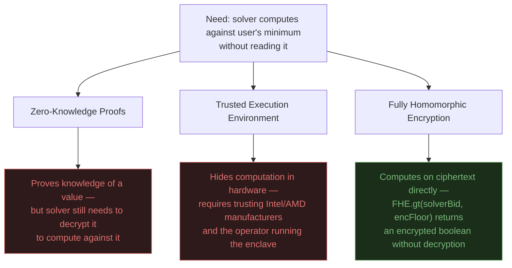
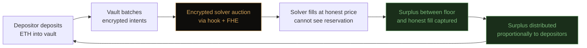
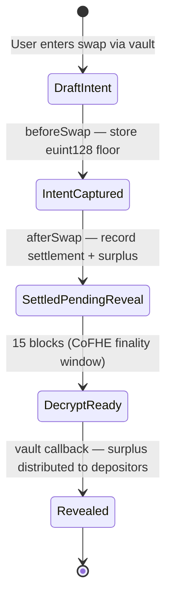
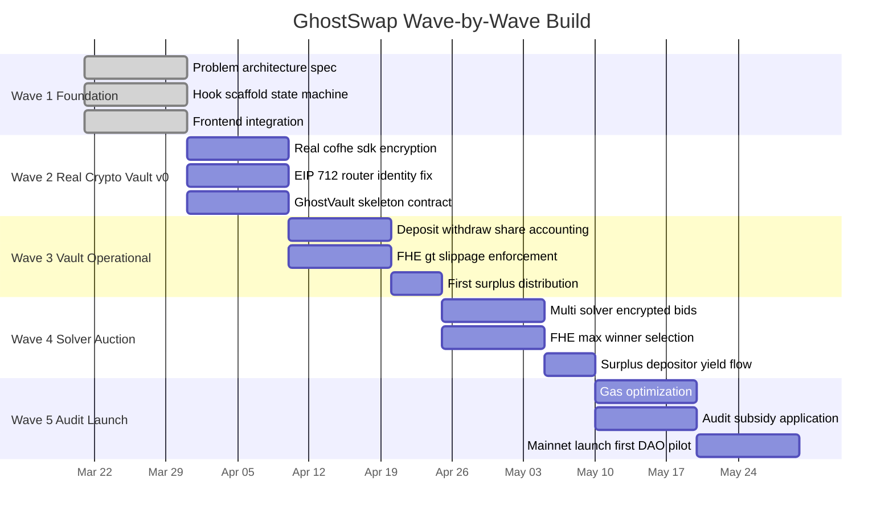

# 👻 GhostSwap

> **An encrypted execution vault on Uniswap v4. Depositors earn yield from surplus recaptured from MEV solvers.**

Built on **Fhenix CoFHE** · **Uniswap v4 Hooks** · **Arbitrum**

---

## What GhostSwap Actually Is

GhostSwap is a **vault protocol** — not a standalone swap interface.

Users deposit assets into the `GhostVault`. The vault executes swaps on behalf of depositors through its paired Uniswap v4 hook (`GhostSwapHook`). The hook encrypts each swap's reservation price using Fhenix CoFHE, forcing solvers to fill at honest prices instead of extracting the surplus between market price and the trader's floor.

**The recaptured surplus becomes yield for vault depositors.**

This is the economic loop: privacy → better execution → surplus capture → yield for depositors → more deposits → more TVL.

---

## The Problem — And Why It's Worth Billions

When you swap on any DEX, your `amountOutMinimum` — the worst price you'll accept — is broadcast in plaintext to every solver before your trade executes. The solver doesn't give you a good price. They give you exactly 1 wei above your floor.

```
Example — standard Uniswap swap:
  You want:   22 ETH → DAI
  Best market price: 3,300 DAI/ETH
  Your floor:        3,100 DAI/ETH  ← visible to every solver

  Solver reads your floor → fills you at 3,102 DAI/ETH
  You receive:    68,244 DAI
  Solver extracts: 4,356 DAI  (invisible, legal, routine)
```

This happens on every transparent DEX. Estimated **$500M+ extracted annually** from DeFi users through this exact mechanism. Nobody pays for it directly — it's baked into worse execution prices that users never notice.

**Existing solutions don't close this gap:**

| Solution | Solves | Misses |
|---|---|---|
| Flashbots Protect | Public mempool bots | Solver still sees your floor |
| MEV Blocker | Sandwich attacks | Solver-side extraction unchanged |
| CoW Protocol | Batch matching | Solver committee sees order parameters |
| 1inch Fusion | Intent-based execution | Resolvers see reservation prices |
| **GhostSwap** | **Solver mathematically cannot read your floor** | — |

---

## The Architecture — Vault + Hook

The architectural moat is the **tight coupling between vault and hook.** Neither works alone. Forking one gives you a broken system.

```mermaid
graph TB
    subgraph Users["Users"]
        D["Depositors<br/>DAOs, whales, treasuries"]
    end

    subgraph Protocol["GhostSwap Protocol"]
        subgraph Periphery["GhostVault Periphery"]
            DEP["Deposit / Withdraw<br/>share accounting"]
            BATCH["Intent Batching<br/>encrypted intent queue"]
            YIELD["Surplus Distribution<br/>proportional yield"]
        end

        subgraph HookLayer["GhostSwapHook"]
            BS["beforeSwap<br/>capture encrypted intent"]
            AS["afterSwap<br/>record surplus captured"]
            AUCTION["Solver Auction<br/>FHE.max on encrypted bids"]
        end
    end

    subgraph Chain["Chain Infrastructure"]
        PM["Uniswap v4 PoolManager"]
        COFHE["Fhenix CoFHE Coprocessor"]
    end

    subgraph Solvers["Solvers"]
        S["Encrypted Bid Submission"]
    end

    D -->|deposit ETH/stables| DEP
    DEP --> BATCH
    BATCH -->|encrypted intent| BS
    BS --> AUCTION
    AUCTION -->|FHE computation| COFHE
    Solvers --> S --> AUCTION
    AUCTION --> PM
    PM --> AS
    AS -->|surplus recaptured| YIELD
    YIELD -->|yield distribution| D

    style Protocol fill:#0e0d0b,stroke:#d4a359,color:#d4a359
    style Periphery fill:#1a1508,stroke:#d4a359
    style HookLayer fill:#0a1a0a,stroke:#7ab87a
```



### Why This Is Defensible

**Fork the hook alone → useless.** The hook expects calls from the vault's specific intent-batching flow. No vault = no intent queue = no batch auctions = the hook does nothing a standard AMM doesn't already do.

**Fork the vault alone → broken.** The vault expects specific post-auction callbacks from the paired hook — surplus accounting, FHE-sealed settlement reporting, encrypted share updates. A standard Uniswap pool produces none of these. Depositors receive no yield because the surplus capture mechanism is gone.

**The defensibility is economic, not just technical.** Depositors in the vault earn yield. Yield attracts more deposits. More deposits = deeper encrypted batches = more solver competition = more surplus captured. The flywheel requires both components running together.

---

## Why FHE — And Why We Own The Trade-Off

### Why Not ZK or TEE



### The Honest FHE Trade-Off

FHE on EVM is **not fully decentralized today.** We're stating this explicitly because any serious reviewer or auditor will ask.

Fhenix CoFHE is a **coprocessor model.** When a contract calls `FHE.decrypt()` or `FHE.gt()`:

1. The computation request is emitted as an on-chain event
2. Fhenix's off-chain coprocessor detects the event
3. The coprocessor performs the actual FHE computation on its hardware
4. The result is posted back on-chain

**What this means in practice:**

| Property | GhostSwap reality |
|---|---|
| Can the solver read your floor? | No — mathematically guaranteed by FHE |
| Can Fhenix read your floor? | No — the coprocessor processes ciphertext without decryption keys |
| Does the system work if Fhenix coprocessor goes offline? | No — reveals and enforcement would stall |
| Is this weaker than a fully on-chain ZK system? | Yes — decentralization-wise. Stronger privacy-wise. |

**We call this "trust-minimized execution," not "trustless execution."** The privacy guarantee is mathematical. The liveness guarantee depends on Fhenix operating their coprocessor. This is the same trade-off every L2 makes with their sequencer today. It's the current state of FHE on EVM — and Fhenix's roadmap moves toward progressive decentralization of the coprocessor.

If you need fully on-chain verifiable privacy today, GhostSwap is not for you. If you need solver-side privacy that actually works on production EVM networks in 2026, FHE via Fhenix is the only primitive that does it.

---

## How The Vault Generates TVL

This is the core economic question. Why would anyone deposit into GhostVault instead of swapping directly?

### The Flywheel



### Who Deposits And Why

**DAO treasuries.** A DAO selling 10,000 ETH over 30 days loses an estimated 0.2-0.8% to solver-side extraction on current DEXes. Depositing into GhostVault:
- Orders execute privately → no reservation price leakage
- Surplus recaptured → appears as positive yield on the deposit
- Treasury optics: "we converted MEV loss into yield" — easily defended in governance

**Market-neutral yield seekers.** The vault's yield comes from MEV extraction that was going to solvers. This yield is uncorrelated with market direction. Unlike LP positions with impermanent loss risk, vault depositors are exposed only to the underlying asset's price — all the yield comes from surplus recapture.

**Privacy-sensitive traders.** Hedge funds, market makers, and traders with competitive strategies who cannot broadcast their reservation prices onchain without leaking information to competitors.

### Realistic TVL Scaling

| Stage | TVL target | Unlock |
|---|---|---|
| Wave 2-3 | $10K-$50K | Testnet proof, first DAO treasury pilot |
| Wave 4-5 | $100K-$500K | Mainnet launch, audit, 2-3 DAO integrations |
| Year 1 post-launch | $2M-$10M | Karpatkey/Llama/Steakhouse integration |
| Year 2 | $50M+ | Institutional adoption, solver network maturity |

**Let's be honest about the hard truth:** getting the first $100K is harder than getting from $10M to $100M. The pitch to the first DAO depositor needs a specific, quantified dollar-loss analysis of their historical treasury operations. That's a manual, relationship-driven sale. There's no shortcut.

---

## Realistic Competition And Positioning

| Competitor | What they do | Why GhostVault is different |
|---|---|---|
| CoW Protocol | Batch matching with solver committee | Solver committee reads order parameters; GhostSwap solvers see ciphertext |
| 1inch Fusion | Intent-based execution with resolvers | Resolvers see reservation prices; same extraction problem |
| Flashbots SUAVE | Private order flow via MEV-share | Still operator-level trust; GhostSwap is mathematical |
| TWAMM (Uniswap) | Time-weighted order splitting | Solves market impact, not price leakage — **we compose with TWAMM, not compete** |
| Arrakis / Gamma | Active LP management vaults | Different problem — LP position management, not trade execution |

**The line we draw:** *"TWAMM solves price impact. GhostSwap solves price leakage. Serious execution needs both."*

This is the pitch that wins. Not "privacy is important" — "you are currently losing basis points to solvers on every single treasury operation, and here is the exact mechanism to stop it and turn it into yield."

---

## Hook Lifecycle — State Machine



---

## Wave Roadmap



**Wave 1 — Foundation** *(complete)*
Hook lifecycle, state machine, local devnet end-to-end, mock FHE.

**Wave 2 — Real Cryptography + Vault Skeleton**
Migrate to `@cofhe/sdk` (cofhejs is sunset). EIP-712 signed intents fixing router identity. First version of `GhostVault.sol` contract — basic deposit/withdraw, no yield distribution yet.

**Wave 3 — Vault Operational**
Vault shares accounting. `FHE.gt()` check queued in `afterSwap` and finalized before reveal — below-minimum fills are rejected during slippage finalization. Surplus distribution mechanism v1. First end-to-end: deposit → encrypted swap → surplus captured → depositor yield.

**Wave 4 — Solver Auction**
Multi-solver encrypted bid submission. `FHE.max()` on ciphertext selects winner. Surplus redistribution flow completed. This is the wave where GhostSwap transforms from privacy primitive to honest price discovery engine.

**Wave 5 — Production**
Gas benchmarks vs baseline Uniswap v4. Security assumptions documented formally. Apply to Uniswap Hook Design Lab audit subsidy. Mainnet launch with one DAO treasury as first depositor.

--
## Current Status

| Component | Status | Notes |
|---|---|---|
| Hook state machine | Working | All 5 states transition correctly on Anvil |
| Block-based reveal delay | Working | 15-block enforcement (CoFHE finality window) |
| Trader-only reveal auth | Working | Wave 2 adds EIP-712 router identity fix |
| Local devnet E2E | Working | Anvil + `cofhe-mock-contracts` |
| Frontend → contract | Connected | Real calls + `@cofhe/sdk` encryption + signed intents |
| Forge test suite | Passing | Hook + vault tests green on Foundry |
| **Vault contract** | Working | `GhostVault` deposit/withdraw shares + surplus attribution |
| **Real FHE encryption** | Working | `@cofhe/sdk` migration complete |
| **Surplus distribution** | Wave 3 in progress | Async slippage finalization + vault surplus forwarding implemented |
| **Solver auction** | Wave 4 | FHE.max mechanic designed, not yet implemented |

---

## Tech Stack

| Layer | Technology |
|---|---|
| Smart Contracts | Solidity 0.8.26 + Foundry |
| FHE | Fhenix `FHE.sol` + CoFHE coprocessor |
| Hook Framework | Uniswap v4 `BaseHook` |
| Client SDK | `@cofhe/sdk` (replaces deprecated cofhejs) |
| Frontend | React + Vite + Tailwind + Viem 2 |
| Testnet | Arbitrum Sepolia |
| Local Dev | Anvil + `cofhe-mock-contracts` |

---

## Setup

```bash
# Clone
git clone https://github.com/anxbt/fhe-hook-template
cd fhe-hook-template

# Contracts
forge install
forge test -vv

# Local devnet
anvil --block-time 2
forge script script/99_LocalSetup.s.sol --rpc-url localhost --broadcast

# Frontend
cd fe && npm install && npm run dev
```

### Environment Variables

```bash
PRIVATE_KEY=
ARBITRUM_SEPOLIA_RPC=
ETHERSCAN_API_KEY=

# Frontend (Vite)
VITE_HOOK_ADDRESS=
VITE_VAULT_ADDRESS=Œ,
VITE_CHAIN_ID=421614
```

---

## Resources

- Fhenix CoFHE Docs — https://cofhe-docs.fhenix.zone
- `@cofhe/sdk` Migration — https://cofhe-docs.fhenix.zone/client-sdk/introduction/migrating-from-cofhejs
- Uniswap v4 — https://docs.uniswap.org/contracts/v4
- Hook Design Lab — https://www.uniswapfoundation.org/blog/introducing-the-uniswap-v4-hook-design-lab

---

## Why This Becomes A Protocol, Not Just A Hook

A hook alone gets forked. A vault alone has no privacy advantage. A vault tightly coupled to an encrypted-execution hook, where depositors earn yield from surplus that was previously extracted by solvers — **that's a protocol with a moat and a reason for TVL to exist.**

The pitch to a DAO treasury is not "please use our privacy feature." It's: **"Your treasury is currently losing 0.3-0.8% to solver extraction on every rebalance. We turn that loss into yield for you."** That's a number a CFO understands.

The FHE centralization trade-off is real and we own it explicitly. The alternative — pretending the CoFHE coprocessor doesn't exist — is the kind of claim that gets a protocol dismissed by serious reviewers. We'd rather ship trust-minimized privacy that actually works than claim trustless perfection that doesn't exist yet in practice.

---

*Built for Fhenix × AKINDO Private By Design Buildathon · Uniswap v4 · Arbitrum*

*Privacy by math. Yield from recaptured surplus. TVL from depositors who trust the numbers.*

<!-- Natural next steps:

Wire periphery execution so solver bids are tied to actual routed fills.
Enforce auction-finalization checkpoints in the reveal/settlement path.
Expose auction status and winner data to the frontend history panel. -->
